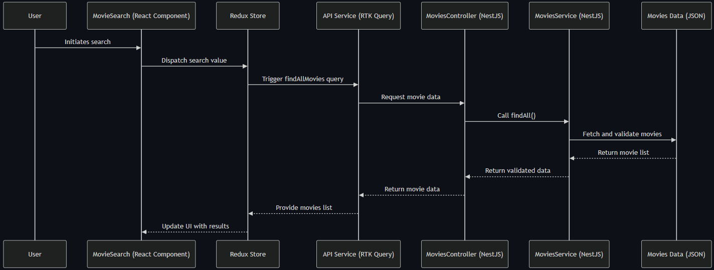
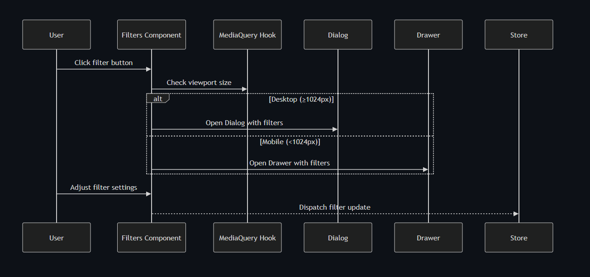

# NextMovies

A movie browsing application built with a Backend-for-Frontend (BFF) architecture, featuring a clean UI and responsive design.

## Getting Started

### Prerequisites

- Docker and Docker Compose installed on your system

### Running the Application

1. Clone the repository
2. In the terminal, navigate to the project root
3. Run the following command: `docker compose up -d`
4. The application should now be running in detached mode

## Key Features and Notes

### Current Implementation

- API service acts as a BFF with hardcoded `movies.json` data
- Client-side filtering for movie titles (debounced fuzzy search)
- Responsive design optimized for desktop and mobile
- Environment variables included in `.env` file.

### Development Notes

- The `.env` file is included in the repository solely for quality control by the Next Insurance team. In a production environment, this should be excluded and managed through a secure vault configuration (like HashiCorp Vault).
- Client-side filtering is currently sufficient due to limited data, but this approach won't scale efficiently with larger datasets.

### Deployment

The application is not currently deployed on any cloud service. Proposed deployment options include:

- **[Fly.io](https://fly.io/)**: A simple, developer-friendly platform for deploying containerized applications with built-in scaling and global distribution.
- **AWS EC2 with [Coolify](https://coolify.io/)**: Leveraging AWS infrastructure paired with Coolify, an open-source Kubernetes pod orchestrator, for a cost-effective, self-hosted solution with robust container management.
- **CI/CD**: GitHub Actions is recommended for continuous integration and deployment, as the repository is hosted on GitHub, enabling seamless workflows for testing, building, and deploying updates.

### Technology Picks

This project leverages the following technologies, chosen for their strengths and alignment with development goals:

- **React**: Selected for its flexibility, extensive ecosystem, and my deep familiarity with it, allowing rapid development and integration with libraries to address frontend challenges.
- **NestJS**: Chosen for its robust framework features, including integrated validation and testing support, and my extensive experience delivering fast, reliable RESTful APIs with it.
- **Fuse.js**: A leading JavaScript library for fuzzy search, providing efficient and accurate client-side search functionality.
- **NX**: Utilized for its monorepo capabilities, learned through my army experience, enabling a well-organized codebase with shared libraries (e.g., `types` for full type-safety).
- **TailwindCSS**: Adopted for its utility-first approach, offering prebuilt responsive design classes and an easy-to-use animation plugin, streamlining UI development.

### Known Limitations

- No "Reset Defaults" button for filters
- Tablet responsiveness may be inconsistent on uncommon devices
- Initial load time for images and data
- Filter button animation not perfectly synced with search bar
- No "No Results Found" message for empty search/filter results

### Improvements

- Move filtering/search to API routes for better scalability
- Implement Autocomplete search with dropdown suggestions
- Add Skeleton components for better loading experience
- Include "Reset Filters" functionality
- Add "No Results Found" messaging
- Improve filter button animation timing

## Technical Details

### Data Flow

### UI Components

## Video Demonstrations

Click the thumbnails below to view showcase videos on YouTube:

### Desktop Experience

### Mobile Experience

